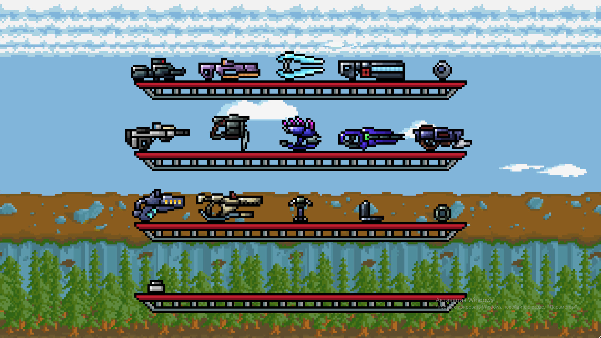
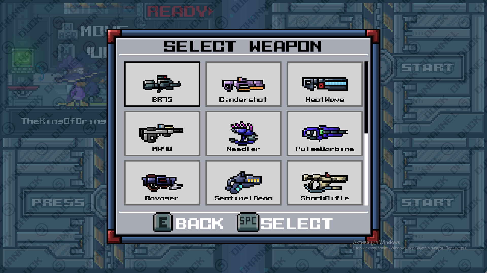

# HaloWeapons
 
Duck Game mod that adds weapons from Halo series and skins system

Steam Workshop: https://steamcommunity.com/sharedfiles/filedetails/?id=2863332635

Dependencies:
-------
- [Harmony](https://github.com/pardeike/Harmony) — Library for patching .NET methods during runtime
- Newtonsoft.Json
- Microsoft.Xna.Framework.Content.Pipeline, XnaContentProvider — for compiling HLSL shaders (only happens in debug mode)
- [RUDE](https://steamcommunity.com/sharedfiles/filedetails/?id=2516142998) — another Duck Game mod. Needed for adding guns to its Gun Game mode

Installing:
-------
- Subscribe to the mod on Steam Workshop(link above) or build it yourself and put into `Users\username\AppData\Roaming\DuckGame\Mods` folder

Building:
-------
- Reference `Duck Game` in your solution
- Download all the dependencies, reference them in your solution and put the `dlls` into `content\DLLs` folder
- Compile the solution

